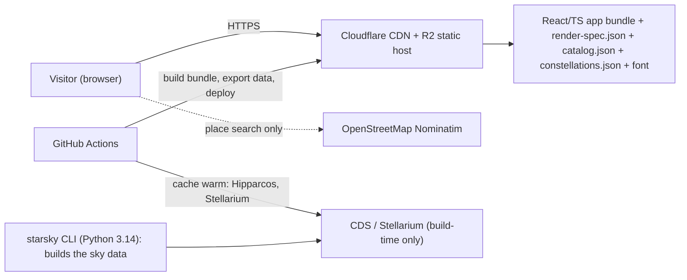
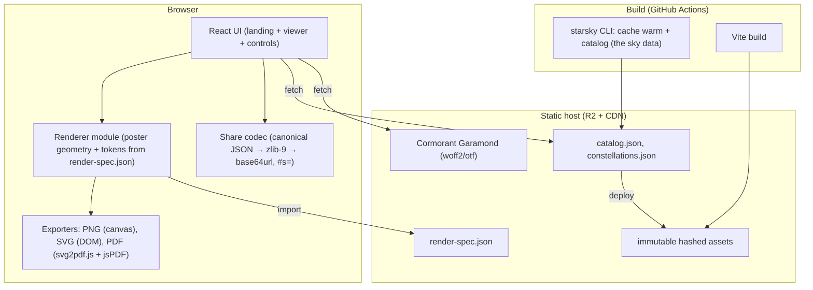

Reconstructed by project:architecture (review → to-be) on 2026-09-29 from 51287a7 (branch `refactor/static-first-client`)

# starsky — architecture

Status: Draft

Mode: **review** (a system exists; as-is recorded, to-be proposed)

## Summary

A **static, client-only product**: one React + TypeScript application built by Vite and served from Cloudflare R2/CDN is the whole runtime — it is the **only renderer**, producing the poster and exporting PNG/SVG/PDF in the browser (ADR-0003). Python 3.14 is a small **CLI data tool**: `starsky catalog` writes the two JSON files the site fetches (`catalog.json`, `constellations.json`), with `starsky cache warm` as its companion (BCR-0005). No server process, no database, no broker, no identity, no ephemeris. This is the target of `docs/product/refactor.md`; the as-is is recorded below and is now largely realised.

## Drivers (ranked)

1. **Correctness** of the rendered poster (visual tokens, caption, geometry) and its determinism — the product *is* the image.
2. **Offline/self-contained** at runtime — no server dependency to view or export a poster.
3. **Cost** — free tier only (R2 free tier + GitHub Actions minutes).
4. Availability 99.9 %+, riding the CDN's own SLA — achievable for free because there is no origin compute.
5. Public site subject to **viral spikes** — CDN absorbs them; originless by design.

Source: user, 2026-09-29. Mode: design decisions follow from these; see *Decisions*.

## Inputs used

`docs/product/brief.md`, `domain-model.md`, `introspec.md`, `refactor.md` + accepted BCRs 0001–0004; `specs/001..006`; the code inventory from `introspec`. No `docs/product/references/`. No metrics available (single-user tool today) — capacity is modelled from estimates, each marked.

## Capacity model

Traffic is unknown (private tool becoming public); figures are `[ASSUMPTION]` and carried through a 10× sensitivity check.

- **Visitors**: assume 1 000 visiting days/month, 1.5 page views each ⇒ ~1 500 PV/month average — trivially low. A viral spike is the real load: `[ASSUMPTION] 50 000 PV in 24 h`, 60 % inside one hour ⇒ `50 000 × 0.6 / 3 600 ≈ 8.3 req/s` edge peak.
- **Payloads**: HTML+JS+CSS ≈ 400 KB brotli `[ASSUMPTION, pre-tune]`; `catalog.json` ≈ 250 KB brotli, `constellations.json` ≈ 30 KB brotli (mag ≤ 6.5, ~8.5 k stars). Total ≈ 0.7 MB first visit.
- **Bandwidth at peak**: `8.3 × 0.7 MB ≈ 6 MB/s ≈ 48 Mbit/s` — a CDN's rounding error; R2 has no egress fee.
- **Origin compute**: **zero** at runtime. The only compute is CI (data export) and the visitor's browser.
- **Browser work**: poster render at 1600 px + export — measured by `site/e2e/perf.spec.ts` under CDP CPU throttling (×4), since a CI container is not a phone. Measured 2026-09-29: **render 387 ms**, exports **PNG 252 ms / SVG 57 ms / PDF 223 ms** (Chromium, throttled). `[RELATIVE]` — the proxy, not the ≤ 2 s mid-range-phone claim, which remains unverified on real hardware.
- **10× check**: 500 000 PV/24 h, 80 req/s peak, ~56 MB/s — still CDN-shaped; first thing to strain is **R2 object request count** (free tier is generous but finite) and CI minutes for cache-warm, not the visitors. Mitigation: long `Cache-Control` + immutable hashed assets (few origin fetches), and CI caching the Python data warm step.

No storage grows: the catalog is a build artifact, not user data.

## As-is (review)

```
CLI (click: catalog | cache warm; bare → help)
  └→ site/ (Vite/React/TS) — the only renderer: poster + PNG/SVG/PDF exports
Data loaders → /tmp/starsky-cache/catalog/{hipparcos.parquet, constellations.parquet}
```

- Two front ends share one functional core: `render_sky_map` (`src/starsky/render/figure.py:259`).
- **No runtime server**: the Gradio app and the Python renderer were removed (BCR-0001/0005). The site is static; the CLI runs only in CI or by hand.
- Hosting: the site on Cloudflare R2; the CLI image on GHCR/Docker Hub. The HF Space is retired (BCR-0003).
- Data: file caches only; no DBMS, no migrations, no personal data. [OBSERVED: `introspec.md` §Data]
- Current bottleneck / headroom: none at runtime — there is no origin. The CI data build downloads the two catalog sources (~13 MB) and is cached between runs; the ephemeris cold start is gone with the renderer.

**Prioritized improvement list**

| # | Issue | Evidence | Recommendation | Effort | Gain |
|---|---|---|---|---|---|
| 1 | Artifact needs a Python server | `gui/pages/sky.py`; `PLAN.md:45-61` | Browser renderer + exports (BCR-0002) | L | Removes the server entirely |
| 2 | Server exposes an unauthenticated UI on 0.0.0.0 | `settings/gradio.py:11` | Delete the server (BCR-0001) | S–M | Removes the attack surface |
| 3 | Silent font fallback ⇒ non-reproducible posters | `data/fonts.py:27-55` | Bundle font, fail loudly (BCR-0004) | S | Deterministic typography |
| 4 | Two renderers may drift | `render/*` vs `site/src/lib/*` | `render-spec.json` normative + conformance tests | M | Enforceable parity |
| 5 | Stateless-host cold re-download | `hf.README.md` | Static-first (no host) | — | Removed by design |
| 6 | `bun test` cannot run vitest cases | `site/src/lib/geocode.test.ts:43,79` | One runner: `bun:test` | S | CI reliability |

## To-be

### C4 — context



### C4 — container



### Deployment view

- **One artifact**: `dist/` (app) + `data/*.json` + font, all uploaded to R2 behind Cloudflare's CDN. Immutable assets under `/assets/<hash>`; data under `/data/<version>/` with a short manifest for cache-busting.
- **Environments**: production (R2 `site` target) and preview (PR build, optional R2 prefix or Pages preview). Local `bun run dev` with Vite; `bun run preview` for the built bundle.
- **CI**: `ci.yml` (Python lint/type/test + data export golden), `site_ci.yml` (Bun: lint, typecheck, `bun test`, build, OG assert), `static_r2.yml` → rename `site_r2.yml` (R2 sync on `main`).
- **No IaC needed** beyond CI config: R2 bucket + CDN is the only infrastructure; `devsecops:iac` can stay N/A or become a tiny OpenTofu root for the bucket + DNS.

### Data view

No database. Stores are files, all build artifacts or browser-local:

| Store | Where | Lifetime | Notes |
|---|---|---|---|
| `catalog.json`, `constellations.json` | R2/CDN | per release | regenerated by `starsky catalog`; versioned path |
| `render-spec.json` | bundle | per release | normative shared contract |
| Font (woff2/otf) | bundle | per release | bundled (BCR-0004) |
| Poster exports | visitor's device | ephemeral | never uploaded |
| Share payload | URL fragment | ephemeral | v1 codec, backward compatible |

No personal data is stored or transmitted (place text goes only to Nominatim, from the browser — `site/src/lib/geocode.ts:15,80`).

## Decisions

| Dimension | Choice | Why / alternative rejected | ADR |
|---|---|---|---|
| Deployment shape | **Single static client; no server** | No independent scaling or ownership need; the only server existed for Gradio. A BFF/API would reintroduce hosting cost and a CORS/secret surface for zero benefit | 0001 |
| Hosting | **Cloudflare R2 + CDN; free tier** | Driver 3 (free) + driver 4 (CDN SLA, originless). PaaS/containers rejected: a server for a static artifact. HF Space rejected: an origin with cold starts (BCR-0003) | 0001, 0003 |
| API style | **No API** (static fetch + URL fragment) | One client, no partners, no cache headers to negotiate. REST/gRPC/GraphQL all N/A | — |
| Data | **Build-artifact JSON on CDN** | Read-only, immutable, tiny; no transactions. A DB would be a component without a driver | — |
| Integration | **Browser → Nominatim only; everything else build-time** | Matches the existing client behaviour; no broker/queue needed | — |
| Identity & access | **None** | Public, read-only, no accounts (user: local-only) | — |
| Multi-tenancy | **N/A** | Single public site | — |
| Resilience & DR | **CDN redundancy; rebuildable from git** | RPO/RTO = restore the last CI build; assets are reproducible; no data to lose. Rebuild trigger documented | 0004 |
| Observability | **R2/Cloudflare analytics + a client-side error hook (optional)** | No server logs to keep; a tiny beacon for render failures is the only useful signal | 0004 |
| Delivery | **GitHub Actions → R2 sync; blue/green by immutable prefix** | Rollback = re-point to the previous prefix | 0002 |
| Cost | **Free tier** | R2 free tier + Actions minutes; egress free | 0002, 0003 |
| Stack | **Bun + React (latest) + TypeScript 7 + Vite + Tailwind; `bun:test`**; Python 3.14 + `uv` + `ruff` + `ty` + `pytest` for the data CLI — dependencies: click, httpx, polars, pydantic(-settings) only | One client toolchain (ADR-0005); the Python tree shrank to its data job (BCR-0005) | 0003, 0005 |

## Cost estimate

- R2: storage of a few MB + read operations within free tier; **$0** at modelled scale (no egress fee). At the 10× spike, request count may approach free-tier limits → warn, not bill.
- GitHub Actions: existing usage; the data warm step is cached to keep minutes low.
- Nominal: **$0/month**; the only cost driver would be exceeding R2 free operations, monitored via Cloudflare dashboards.
- Cheapest acceptable alternative: GitHub Pages (also $0) — rejected only because R2 + Cloudflare CDN is already wired and gives explicit cache control + analytics.

## Risks

- **Visual regression** (biggest): the poster is the product and the renderer is the only implementation — mitigated by the reference-image suite (`refactor.md` T024) and the `render-spec.json` conformance test.
- **Browser performance/battery** for the 1600 px poster on low-end phones — a render budget and device-class profiling in `qa:load`.
- **Free-tier request ceilings** at extreme virality — immutable assets + long cache keep origin fetches minimal; alarm on R2 operation counts.
- **TypeScript 7 migration** — isolated, reversible slice; the compiler ships as a dev pre-release while 7.0 stabilises.
- **Single-host dependency** on R2/Cloudflare — acceptable at this cost target; the artifact is rebuildable anywhere.
- **WebKit untested** — no `standalone-webkit` image exists; Safari is not a supported browser until a Playwright-container exception is added.

## Architecture fitness functions (automatable)

1. **No server**: CI fails if any Python module imports a web framework or opens a socket; `python -m starsky` exits without binding.
2. **Contract conformance**: `render-spec.json` and the TS `SPEC` must match field for field (`site/src/lib/spec.test.ts`).
3. **Visual regression**: the fixture matrix renders in the browser against stored reference PNGs; unexplained change fails (replaces the removed CLI parity harness).
4. **Bundle budget**: `dist/` ≤ 500 KB brotli (excluding font) and `data/` ≤ 400 KB brotli; CI fails over.
5. **No secrets in the bundle**: a CI scan fails on any `*_TOKEN`/key-like string in `dist/`.
6. **Offline render**: a test renders and exports with network disabled (font bundled).

## Evolution path (with triggers)

| Trigger | Evolution |
|---|---|
| Renderer grows features the CLI can't follow (fire on `render-spec.json` divergence > 1 release) | Retire the CLI renderer, keep Python as data-export only |
| `data/` exceeds the bundle budget (> 400 KB brotli, e.g. mag limit raised) | Move data to an R2 prefix fetched on demand with `Cache-Control: immutable` (already same-origin) |
| R2 free-tier operations exceeded for a sustained week | Raise mag-limit trimming / gzip-brotli precompress / move data to a cheaper CDN pattern |
| A hosted/shared feature is requested (accounts, saved posters) | Reopen architecture: add an API + identity per that brief (`project:refactor` BCR) |
| Poster render p95 on mid-range phones > 4 s | Precompute common skies, or move heavy paths to an OffscreenCanvas worker |

## Open questions

- Exact render/export performance budgets per device class (to set in `qa:load`).
- Whether a client-side error beacon is wanted (adds a third-party endpoint).
- Final mag-limit for the shipped catalog (cost vs. star density).
